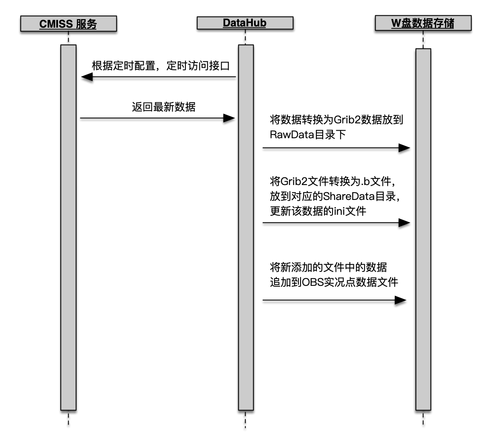

---

  文档更新日期：2019-09-09

---

###  **新特性**

 1. 新的CMISS数据任务集数据下载和转化为一体，改变之前数据下载和转化需要分别配置的情况。
 2. 自动处理单个CMISS接口中包括的所有要素，无须为单个要素新建不同的数据处理任务。
 3. 支持并发处理数据任务，稳定性更高。
 4. 处理数据的时效性更高，支持数据更新消息提醒。
 5. 缩短了数据处理任务的配置时间，新建任务时自动生成相关配置。
 6. 运行于B/S架构，可以在任何机器上监控数据任务的运行情况。

## **主页**
 主页提供了系统运行情况总览的视图，包括错误日志，任务数量统计和快捷导航。

 
## **数据服务**
所有数据任务都在此设置和管理。

###  **CMISS**

所有通过CMISS接口获取的数据任务都在此管理，包括地面观测、数值预报、雷达、云图、城镇预报、台风路径和旅游。

  
<strong>备注：</strong> 目前旅游数据仅适用于个别用户。

#### **快速开始**

1. 打开DataHub 2.0，进入到**数据服务**-**CMISS**
2. 点击**经纬度配置**设置数据源，设置省市编号,站点级别,保存。

  
<strong>备注：</strong>  - 格点数据的经纬度配置和此处的经纬度配置是共用的，建议选择自动站较多的一小时气温数据读取经纬度配置。 - 省市编号，选择当前所处省份  - 站点级别：011、012、013表示国家站，只针对obs.xml文件 - 数据源参考 http://服务器IP/cimiss-web/api?userId=CMISS用户名&pwd=CMISS密码 

3. 手动执行一条任务,可以下载到xls数据文件。
4. 点击经纬度配置选择刚下载的xls文件读取经纬度信息,保存。
5. 手动执行一条任务,检查数据在引擎的渲染效果。
6. 根据渲染效果调整经纬度。
7. 点击定时配置,配置数据的更新时间。
8. 点击激活,开启数据自动处理。

**经纬度配置**

**定时配置**

|序号| 数据类型 |更新频次 |
|--|--|--|
|1| 地面观测 |每10分钟|
|2| 数据预报 |每天的4点、16点|
|3| 雷达 |每6分钟|
|4| 云图 |每小时的10分，40分|
|5| 城镇预报 |每小时的47分|
|6| 台风 |每小时的13分|
|7| 旅游 |每个整点|

  
<strong>备注：</strong> 上表中的时间使用24小时制。

#### **地面观测**

CMISS地面观测数据处理流程

##### **添加地面观测**

 1. 点击**添加新项目**
 2. 选择**地面观测**页签
 3. 填入**数据名称**，例如：自动站逐小时观测

  
<strong>备注：</strong> 数据名称中英文都可以。

 4. 选择**接口类型**，例如：地面逐小时资料
 6. 选择**目标路径**，例如：W:\SharedData\FetchData

  
<strong>备注：</strong> 系统会根据**接口类型**自动在设置的**目标路径**下自动新建对应的数据文件夹。

**地面观测接口类型及数据类型对应表**

 |序号| 接口类型 |数据类型 |
|--|--|--|
| 1 | 地面逐小时资料 | AWS_TEM(自动站整点气温) AWS_Tmax1H(自动站1小时最高温) AWS_Tmin1H(自动站1小时最低温) AWS_Tmax24H(自动站24小时最高气温) AWS_Tmin24H(自动站24小时最低气温） AWS_TEM_Change_24H(自动站24小时变温) AWS_Rain1H(自动站1小时降雨量) AWS_CLO_Cov(自动站总云量) AWS_RHU1H(自动站1小时相对湿度) AWS_CLO_Cov_Low(自动站低云量) |
| 2 | 地面日值资料 |AWS_Rain_2008(20到08时的降水) AWS_Rain_2008(20到08时的降水) AWS_Rain_2008(20到08时的降水) AWS_Rain_0820(08到20时的降水) AWS_Rain_2020(20到20时的降水) AWS_Rain_0808(08到08时的降水) AWS_Tmax1D(日最高温) AWS_Tmin1D(日最低温) AWS_Diff1D(日温差） AWS_DTMax1D(日最高变温） AWS_DTMin1D(日最低变温） RHU_Avg1D(日平均相对湿度） RHU_Min1D(日最小相对湿度） VIS_Min1D(日最低能见度）  |
| 3 | 地面资料统计 |AWS_ACCRain24H(自动站24小时降雨量 AWS_Rain3H(自动站3小时降雨量) AWS_Rain6H(自动站6小时降雨量) AWS_Rain12H(自动站12小时降雨量) AWS_VIS24H(自动站24小时最小能见度)  AWS_WIN24H(自动站24小时极大风) |
| 4 | 累计降水 | AWS_ACCRain（自动站手动逐小时累计降雨量）|
| 5 | 统计降水 | AWS_CountRain（自动站手动降雨量总和）|
| 6 | 逐小时环境 | |

#### **数值预报**

CMISS数值预报处理流程

CMISS智能网格处理流程

##### **添加数值预报**

 1. 点击**添加新项目**
 2. 选择**数值预报**页签
 3. 填入**数据名称**，例如：欧洲中心细网格

  
<strong>备注：</strong> 数据名称中英文都可以。

 4. 选择**接口类型**，例如：欧洲中心-高分辨率-东北亚
 5. 选择**要素** ，例如：TEM 925、TEM 850、GPH 500

  
<strong>备注：</strong> 只有接口类型是 欧洲中心-高分辨率-东北亚 需要选择要素。

 6.  选择**目标路径**，例如：W:\SharedData\FetchData
 

  
<strong>备注：</strong> 系统会根据所选择的**要素**自动在设置的**目标路径**下自动新建文件夹。。

**接口类型列表**

|序号| 接口类型 | 备注 |
|--|------------|------|
| 1 | 欧洲中心-高分辨率-东北亚 | |
| 2 | 省级格点预报订正产品 | 智能网格|
| 3 | 全国雨量落区预报产品 | D14类数据|

**数值预报-欧洲中心-高分辨率-东北亚-接口要素及数据文件对应表**

|序号| 要素|数据文件 |
|--|--|--|
| 1 | TEM 925 | Ecthin_TEM925(EC亚洲925百帕温度)|
| 2 | TEM 850 | Ecthin_TEM850(EC亚洲850百帕温度)|
| 3 | RHU 850 | Ecthin_RHU850(EC亚洲850百帕相对湿度) |
| 4 | RHU 925 | Ecthin_RHU925(EC亚洲925百帕相对湿度) |
| 5 | GPH 500 | Ecthin_GPH500(EC亚洲500百帕位势高度)|
| 6 | GPH 700 | Ecthin_GPH700(EC亚洲700百帕位势高度)|
| 7 | GPH 850 | Ecthin_GPH850(EC亚洲850百帕位势高度)|
| 8 | GPH 925 | Ecthin_GPH925(EC亚洲925百帕位势高度)|
| 9 | GPH 1000 | Ecthin_GPH1000(EC亚洲1000百帕位势高度)|
| 10 | WINU WINV 500 | Ecthin_UV500(EC亚洲500百帕风场)|
| 11 | WINU WINV 700 | Ecthin_UV700(EC亚洲700百帕风场)|
| 12 | WINU WINV 850 | Ecthin_UV850(EC亚洲850百帕风场)|
| 13 | WINU WINV 925 | Ecthin_UV925(EC亚洲925百帕风场)|

#### **雷达**

CMISS雷达处理流程

##### **添加雷达**

 1. 点击**添加新项目**
 2. 选择**雷达**页签
 3. 填入**数据名称**，例如：Local_1

  
<strong>备注：</strong> 数据名称中英文都可以。

4.  选择**目标路径**，例如：W:\SharedData\Images_DB

#### **卫星云图** 

CMISS卫星云图处理流程

##### **添加卫星云图**

 1. 点击**添加新项目**
 2. 选择**云图**页签
 3. 填入**数据名称**，例如：IR1

  
<strong>备注：</strong> 数据名称中英文都可以。

4.  选择**目标路径**，例如：W:\SharedData\Images_DB

#### **城镇预报**
此任务会将SNFWD精细化报文转换为格点数据和点数据。

CMISS城镇预报处理流程

##### **添加城镇预报**

 1. 点击**添加新项目**
 2. 选择**城镇预报**页签
 3. 填入**数据名称**，例如：CSYB

  
<strong>备注：</strong> 数据名称中英文都可以。

4.  选择**目标路径**，例如：W:\SharedData\FetchData

#### **台风路径**

CMISS台风处理流程

##### **添加台风路径**

1. 点击**添加新项目**
 2. 选择**台风路径**页签
 3. 填入**数据名称**，例如：typhoon

  
<strong>备注：</strong> 数据名称中英文都可以。

2.  选择**目标路径**，例如：W:\SharedData\FetchData

####  数据任务的其它操作

 - **激活**任务
 - 修改**配置**

  
<strong>备注：</strong> 修改配置时任务必须处于非激活状态。

 - **手动**执行任务
 1. 点击**手动**按钮
 2. 选择开始日期和结束日期，并点击确定。
 - 查看**日志**

---
###  **格点数据**

处理非CMISS接口的格点数据，包括自动站、D4类数据、D11类数据、D14类数据、GRB2数据（单要素）和GRB2数据（多要素）

#### **自动站数据**

Micaps自动站数据处理流程

#### **添加自动站数据**

 1. 点击**添加新项目**
 2. 选择**自动站**页签
 3. 填入**数据名称**，例如：AWS_Tmin1H
 

  
<strong>备注：</strong> 数据名称建议使用英文命名。

 4. 选择**数据路径**，例如：D:\Micaps_data\AWS\AWS_Tmin1H
 5. 选择**目标路径**，例如：W:\SharedData\FetchData\newIsoTherms
 

  
<strong>备注：</strong>系统会根据**数据名称**自动在设置的**目标路径**下自动新建文件夹。

 6. 设置**列表数量**，设置为：100
 7. 设置**源数据时区**，点击确认保存。

#### **D4类数据**

Micaps D4类数据处理流程

 

  
<strong>备注：</strong> 只有数据的时次跟上次时次不同才会清空数据清数据文件夹。

##### **添加D4类数据**

 1. 点击**添加新项目**
 2. 选择**D4类数据**页签
 3. 填入**数据名称**，例如：Ecthin_GPH500
 

  
<strong>备注：</strong> 数据名称建议使用英文命名。

 4. 选择**数据路径**，例如：D:\Micaps_data\Ecthin\Ecthin_GPH500
 5. 选择**目标路径**，例如：W:\SharedData\FetchData\newIsoBars
 

  
<strong>备注：</strong> 系统会根据**数据名称**自动在设置的**目标路径**下自动新建文件夹。

 6. 设置**数据类型**，例如：设置为预报
 7. 设置**源数据时区**，例如：选择“按北京时”，点击确认保存。

#### **D11类数据**

Micaps D11类数据处理流程

 

  
<strong>备注：</strong> 只有数据的时次跟上次时次不同才会清空数据清数据文件夹。

##### **添加D11类数据**

 1. 点击**添加新项目**
 2. 选择**D11类数据**页签
 3. 填入**数据名称**，例如：Ecthin_UV500
 

  
<strong>备注：</strong> 数据名称建议使用英文命名。

 
 4. 选择**数据路径**，例如：D:\Micaps_data\Ecthin\Ecthin_UV500
 5. 选择**目标路径**，例如：W:\SharedData\FetchData\Wind
 

  
<strong>备注：</strong> 系统会根据**数据名称**自动在设置的**目标路径**下自动新建文件夹。

 6. 设置**列表数量**，设置为：100
 7. 设置**数据类型**，例如：设置为预报
 8. 设置**源数据时区**，例如：选择“按北京时”，点击确认保存。

#### **D14类数据**

Micaps第14类数据处理流程

##### **添加D14类数据**

 1. 点击**添加新项目**
 2. 选择**D14类数据**页签
 3. 填入**数据名称**，例如：D14
 

  
<strong>备注：</strong> 数据名称建议使用英文命名。

 4. 选择**数据路径**，例如：D:\Micaps_data\D14
 5. 选择**目标路径**，例如：W:\SharedData\FetchData\newIsoPrecip
 

  
<strong>备注：</strong> 系统会根据**数据名称**自动在设置的**目标路径**下自动新建文件夹。

#### **GRB2数据（单要素）**

MicapsGRB2数据处理流程 

##### **GRB2数据（单要素）**
 1. 点击**添加新项目**
 2. 选择**GRB2数据（单要素）**页签
 3. 填入**数据名称**，例如：
 

  
<strong>备注：</strong> 数据名称建议使用英文命名。

 4. 选择**数据路径**，例如：D:\Micaps_data\Ecthin\SmartGrid_SPCC
 5. 在
 6. 选择**目标路径**，例如：W:\SharedData\FetchData\newIsoTherms
 

  
<strong>备注：</strong> 系统会根据**数据名称**自动在设置的**目标路径**下自动新建文件夹。

 7. 设置**列表数量**，设置为：100
 8. 设置**数据类型**，例如：设置为预报
 9. 设置**源数据时区**，例如：选择“按北京时”，点击确认保存。

####  数据任务的其它操作
 - **激活**任务
 - 修改**配置**
 

  
<strong>备注：</strong> 修改配置时任务必须处于非激活状态。

 - **手动**执行任务
 1. 点击**手动**按钮
 2. 选择开始日期和结束日期，并点击确定。
 - 查看**日志**

---
###  卫星云图
处理非CMISS接口的卫星云图数据

Micaps卫星云图处理流程 

##### 添加卫星云图

 1. 点击**添加新项目**
 2. 填入**数据名称**，例如：IR1
 3. 选择**数据路径**，例如：D:\Micaps_data\satellite
 4. 选择**目标路径**，例如：W:\SharedData\Images_DB\satellite
 

  
<strong>备注：</strong> 系统会根据**数据名称**自动在设置的**目标路径**下自动新建文件夹。

 5. 选择**卫星配置**的**通道**，例如：IR1
 

  
<strong>备注：</strong> 系统目前会默认选择IR1进行处理，此配置是方便之后扩展，可不设置。

 6. 设置**源数据时区**，例如：选择“按北京时”，点击确认保存。

---
###  雷达
处理非CMISS接口的的雷达数据，包括Bin、Pup、LatLon和多站拼图。

Micaps雷达（需拼图）数据处理流程 

Micaps雷达数据处理流程 

|序号| 雷达|备注 |
|--|--|--|
| 1 | Bin | |
| 2 | Pup | |
| 3 | LatLon |天气网使用的雷达产品，无须拼图 |
| 4 | 多站拼图 | |

##### 添加Pup
 1. 点击**添加新项目**
 2.  选择**Pup**页签
 3. 填入**数据名称**，例如：Pup
 4. 选择**数据路径**，例如：D:\Micaps_data\radar\Z9770
 5. 选择**目标路径**，例如：W:\SharedData\Images_DB\radar
 

  
<strong>备注：</strong> 系统目前会默认选择IR1进行处理，此配置是方便之后扩展，可不设置。

 6. 设置**源数据时区**，例如：选择“按北京时”，点击确认保存。

##### 添加多站拼图
 1. 点击**添加新项目**
 2.  选择**多站拼图**页签
 3. 填入**数据名称**，例如：多站拼图
 4. 选择**数据路径**，例如：D:\Micaps_data\radar\radar_pt
 5. 选择**目标路径**，例如：W:\SharedData\Images_DB\radar
 

  
<strong>备注：</strong> 系统目前会默认选择IR1进行处理，此配置是方便之后扩展，可不设置。

 5. 设置**源数据时区**，例如：选择“按北京时”，点击确认保存。
---
###  城市预报
处理非CMISS接口的城市预报数据，也会同时转为格点数据和点数据。

#### 添加城镇预报

Micpas城镇预报数据处理流程 

 1. 点击**添加新项目**
 2. 填入**数据名称**，例如：snwfd_hainan
 3. 选择**数据路径**，例如：D:\Micaps_data\pointdata\SNWFD_local
 4. 选择**目标路径**，例如：W:\SharedData\FetchData
 

  
<strong>备注：</strong> 系统目前会默认选择IR1进行处理，此配置是方便之后扩展，可不设置。

 5. 选择**是否移除小数点**
 6. 设置**可选参数**，包括备份路径、是否移除数据。

###  脚本调用
目前只使用在电码的数据转换。
###  全国站点管理
管理站点的中文名称对照表。
### 设置
#### 系统设置
##### 配置设置

 

